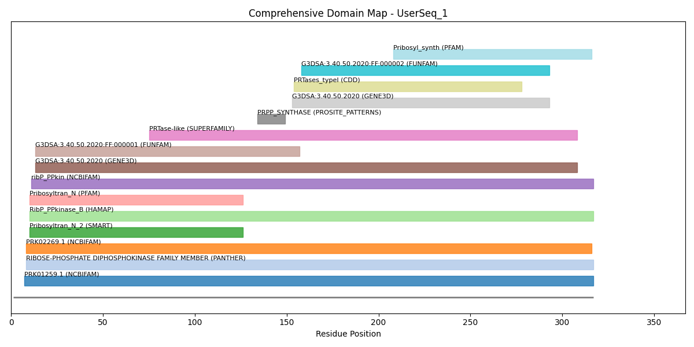
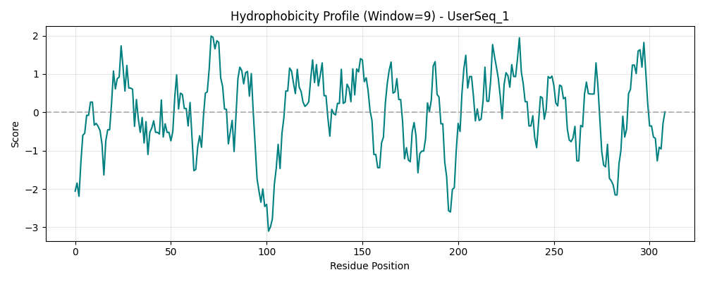

# 蛋白质深度分析报告: UserSeq_1

## 1. 分析序列 (Input Sequence)
```fasta
>UserSeq_1
MSNQYGDKNLKIFSLNSNPELAKEIADIVGVQLGKCSVTRFSDGEVQINIEESIRGCDCY
IIQSTSDPVNEHIMELLIMVDALKRASAKTINIVIPYYGYARQDRKARSREPITAKLFAN
LLETAGATRVIALDLHAPQIQGFFDIPIDHLMGVPILGEYFEGKNLEDIVIVSPDHGGVT
RARKLADRLKAPIAIIDKRRPRPNVAEVMNIVGNIEGKTAILIDDIIDTAGTITLAANAL
VENGAKEVYACCTHPVLSGPAVERINNSTIKELVVTNSIKLPEEKKIERFKQLSVGPLLA
EAIIRVHEQQSVSYLFS
```

## 2. 理化性质分析 (Physicochemical Properties)
| 性质 | 计算值 |
| --- | --- |
| Length (aa) | 317 |
| Molecular Weight (Da) | 34867.86 |
| Isoelectric Point (pI) | 5.94 (Bjellqvist Scale) |
| Instability Index | 39.11 (<40 Stable, >40 Unstable) |
| Aromaticity | 0.050 |
| GRAVY (Grand Average of Hydropathy) | -0.018 (-: Hydrophilic, +: Hydrophobic) |

## 3. 全量结构域地图 (Domain Map)


### 结构域详细列表 (按位置排序)
| Position | Name | Accession | Database | Link |
| --- | --- | --- | --- | --- |
| 7-317 | PRK01259.1 | NF002320 | NCBIFAM | [Search InterPro](https://www.ebi.ac.uk/interpro/search/text/NF002320) |
| 8-317 | RIBOSE-PHOSPHATE DIPHOSPHOKINASE FAMILY MEMBER | PTHR10210 | PANTHER | [View PANTHER](https://www.ebi.ac.uk/interpro/entry/panther/PTHR10210) |
| 8-316 | PRK02269.1 | NF002618 | NCBIFAM | [Search InterPro](https://www.ebi.ac.uk/interpro/search/text/NF002618) |
| 10-126 | Pribosyltran_N_2 | SM01400 | SMART | [View SMART](https://www.ebi.ac.uk/interpro/entry/smart/SM01400) |
| 10-317 | RibP_PPkinase_B | MF_00583_B | HAMAP | [Search InterPro](https://www.ebi.ac.uk/interpro/search/text/MF_00583_B) |
| 10-126 | Pribosyltran_N | PF13793 | PFAM | [View Pfam](https://www.ebi.ac.uk/interpro/entry/pfam/PF13793) |
| 11-317 | ribP_PPkin | TIGR01251 | NCBIFAM | [Search InterPro](https://www.ebi.ac.uk/interpro/search/text/TIGR01251) |
| 13-308 | G3DSA:3.40.50.2020 | G3DSA:3.40.50.2020 | GENE3D | [View GENE3D](https://www.ebi.ac.uk/interpro/entry/gene3d/G3DSA%3A3.40.50.2020) |
| 13-157 | G3DSA:3.40.50.2020:FF:000001 | G3DSA:3.40.50.2020:FF:000001 | FUNFAM | [Search InterPro](https://www.ebi.ac.uk/interpro/search/text/G3DSA%3A3.40.50.2020%3AFF%3A000001) |
| 75-308 | PRTase-like | SSF53271 | SUPERFAMILY | [View SUPERFAMILY](https://www.ebi.ac.uk/interpro/entry/superfamily/SSF53271) |
| 134-149 | PRPP_SYNTHASE | PS00114 | PROSITE_PATTERNS | [Search InterPro](https://www.ebi.ac.uk/interpro/search/text/PS00114) |
| 153-293 | G3DSA:3.40.50.2020 | G3DSA:3.40.50.2020 | GENE3D | [View GENE3D](https://www.ebi.ac.uk/interpro/entry/gene3d/G3DSA%3A3.40.50.2020) |
| 154-278 | PRTases_typeI | cd06223 | CDD | [View CDD](https://www.ebi.ac.uk/interpro/entry/cdd/cd06223) |
| 158-293 | G3DSA:3.40.50.2020:FF:000002 | G3DSA:3.40.50.2020:FF:000002 | FUNFAM | [Search InterPro](https://www.ebi.ac.uk/interpro/search/text/G3DSA%3A3.40.50.2020%3AFF%3A000002) |
| 208-316 | Pribosyl_synth | PF14572 | PFAM | [View Pfam](https://www.ebi.ac.uk/interpro/entry/pfam/PF14572) |

## 4. 疏水性分布图 (Hydrophobicity Profile)


## 5. 建模与深度挖掘门户 (Action Portal)
### 🧬 结构建模 (AlphaFold / ColabFold)
- **[前往 AlphaFold 数据库搜索](https://alphafold.ebi.ac.uk/search/text?q=MSNQYGDKNLKIFSLNSNPE)**
- **[使用 ColabFold (从头建模)](https://colab.research.google.com/github/sokrypton/ColabFold/blob/main/AlphaFold2.ipynb)**

## 6. 同源性比对 (Homology Analysis - BLASTP)
> **Note**: 为了保证功能预测的高可靠性，脚本默认检索 **SwissProt (Reviewed)** 数据库。如果您需要检索包括预测序列在内的全量数据库（如 `nr`），请前往：
> **[👉 NCBI BLASTP 官方网站](https://blast.ncbi.nlm.nih.gov/Blast.cgi?PROGRAM=blastp&PAGE_TYPE=BlastSearch&LINK_LOC=blasthome)**

| Accession | Identity | E-value | Title | Link |
| --- | --- | --- | --- | --- |
| P14193 | 100% | 0.0 | SP:P14193 KPRS_BACSU Ribose-phosphate pyrophosphokinase OS=Bacillu...  619     0... | [View UniProt](https://www.uniprot.org/uniprotkb/P14193/entry) |
| Q81J97 | 85% | 0.0 | SP:Q81J97 KPRS_BACCR Ribose-phosphate pyrophosphokinase OS=Bacillu...  533     0... | [View UniProt](https://www.uniprot.org/uniprotkb/Q81J97/entry) |
| Q81VZ0 | 85% | 0.0 | SP:Q81VZ0 KPRS_BACAN Ribose-phosphate pyrophosphokinase OS=Bacillu...  533     0... | [View UniProt](https://www.uniprot.org/uniprotkb/Q81VZ0/entry) |
| O33924 | 85% | 0.0 | SP:O33924 KPRS_CORAM Ribose-phosphate pyrophosphokinase OS=Coryneb...  533     0... | [View UniProt](https://www.uniprot.org/uniprotkb/O33924/entry) |
| Q8EU34 | 79% | 0.0 | SP:Q8EU34 KPRS_OCEIH Ribose-phosphate pyrophosphokinase OS=Oceanob...  510     0... | [View UniProt](https://www.uniprot.org/uniprotkb/Q8EU34/entry) |

## 7. AI 辅助功能预测结论 (AI-Assisted Function Prediction)
### 7.1 调查总结 (Investigation Summary)
> The input protein has a length of 317 aa with an estimated molecular weight of 34867.86 Da. The computed isoelectric point (pI) is 5.94, and the instability index is 39.11. No obvious transmembrane segments were detected, suggesting a soluble protein. Domain scanning indicates core components: Pribosyl_synth, Pribosyltran_N. Homology search shows the top SwissProt hit is P14193 (identity: 100%).

### 7.2 功能预测 (Functional Prediction)
**Given the lack of well-characterized domains and high-identity curated homologs, this protein may represent a novel biochemical function. Consider AlphaFold-based structural modeling to identify potential ligand-binding pockets or interaction interfaces.**

### 7.3 Related Literature Search
- [PubMed Search](https://pubmed.ncbi.nlm.nih.gov/?term=Pribosyl_synth+Pribosyltran_N)

--- 
*免责声明：本综述由 Trae AI 蛋白分析助手基于集成生物信息学数据自动合成，仅供参考。请结合实验或专业文献进行验证。*

### 🧬 二级结构倾向预测
- Helix (Alpha-helix): 32.2%
- Turn (Coil/Loop): 27.1%
- Sheet (Beta-sheet): 37.2%
